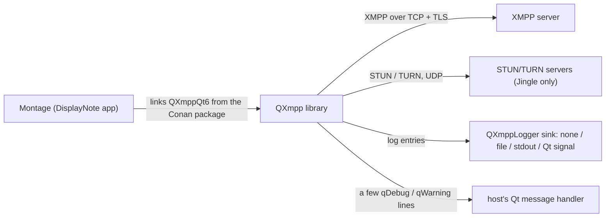
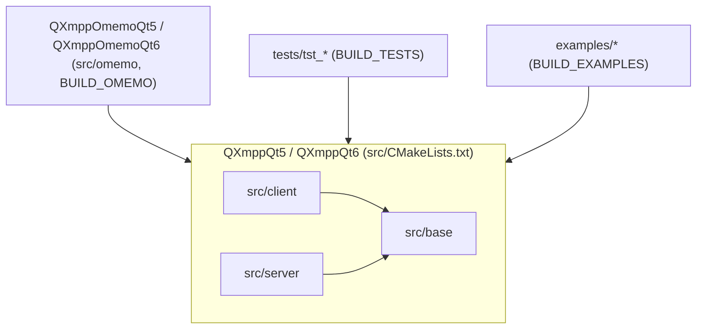
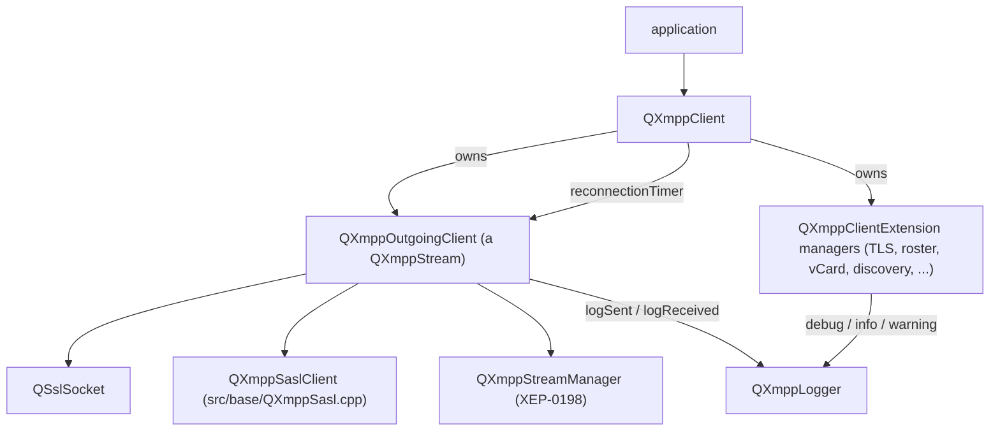

# Architecture — qxmpp (DisplayNote fork, `1.6` line)

Upstream API documentation (Doxygen) is built from `doc/` and the source comments
(`-DBUILD_DOCUMENTATION=ON`, see `CONTRIBUTING.md`); this file covers what an agent
needs to navigate the code.

## Context

How Montage configures the library (which logger type, which managers) is not visible in
this repository.

## Containers (build targets)

- `base`, `client` and `server` compile into one library; shared by default
  (`BUILD_SHARED=ON`, and it must stay shared for LGPL compliance per `README.md`). Qt major
  version is picked by `QT_VERSION_MAJOR` (prefers Qt 6).
- Optional features are compile-time: `WITH_QCA` (encrypted file sharing; required by OMEMO),
  `WITH_GSTREAMER` (Jingle audio/video in `QXmppCallManager`), `BUILD_OMEMO`. DisplayNote CI
  does not enable any of them (`cmakeCommonArgs` in `ci/azure-pipelines.yml`); QCA is only
  picked up if `find_package(Qca-qt6)` succeeds on the agent.
- `BUILD_UNVERSIONED_LIBRARY=ON` (DisplayNote, `CMakeLists.txt` and `src/CMakeLists.txt`)
  drops `VERSION`/`SOVERSION` so the install tree has one library file instead of a symlink chain.

## Components (client side)

## Main data flows

**Connect** (`src/client/QXmppOutgoingClient.cpp`): `QXmppClient::connectToServer()` →
`QXmppOutgoingClient::connectToHost()` → the configured host/port, or a DNS SRV lookup of
`_xmpp-client._tcp.<domain>` (line 240) → TCP → stream open → `<stream:features>` → STARTTLS
(`src/client/QXmppTlsManager.cpp`, an internal client extension) → SASL (lines 453–516) or non-SASL `jabber:iq:auth` (XEP-0078, only when SASL is not offered or
disabled, or the server opens a pre-1.0 stream, and `useNonSASLAuthentication()` is on — the
default) → resource bind or stream resumption → `connected()`.
SASL mechanism: the first entry of `QXmppSaslClient::availableMechanisms()`
(`src/base/QXmppSasl.cpp`: SCRAM-SHA3-512, SCRAM-SHA-512, SCRAM-SHA-256, SCRAM-SHA-1,
DIGEST-MD5, PLAIN, ANONYMOUS, then the OAuth-style X-FACEBOOK-PLATFORM / X-MESSENGER-OAUTH2 /
X-OAUTH2, which are dropped unless their access token is configured) that the server offers,
after moving `QXmppConfiguration::saslAuthMechanism()` (empty by default) to the front.

**DisplayNote resumption workaround**: the resume host announced in `<enabled location=…>`
is still parsed (`setResumeAddress()`), but `connectToHost()` no longer connects to it
(lines 223–229, AB#115566 — the announced host was an internal name that clients could not
reach). After `<enabled/>`, `<resumed/>` or `<failed/>`, `sessionStarted` is forced `true`
(lines 758–759, 771–772, 797–798) so `isConnected()` (line 282) is true.

**Reconnect** (`src/client/QXmppClient.cpp`, DisplayNote): `getNextReconnectTime()`
(lines 69–98) returns 5–15 s for the first 5 tries, 15–25 s up to 10, 35–45 s up to 15 and
50–70 s afterwards (random jitter from `QRandomGenerator`) and prints the try count and delay
with `qDebug()` (lines 94–95). `_q_streamDisconnected()` (lines 963–974) restarts the
reconnection timer when it is not running, auto-reconnect is enabled, no resource conflict was
received and the client presence is still `Available` (it also prints a `qDebug()` line,
971); `disconnectFromServer()` sets presence `Unavailable` first, so an explicit logout does not
reconnect. `_q_streamConnected()` stops the timer and resets the try count (lines 946–951).

**Send**: managers and the application call `QXmppClient::sendPacket()` / `send()` →
`QXmppStream::sendPacket()` (stream-management queueing) → `QXmppStream::sendData()`
(`src/base/QXmppStream.cpp:145`), which first emits `logSent(<raw XML>)` (line 147) and then
writes to the `QSslSocket`. Every outbound byte of the XML stream goes through this function.

**Receive**: `QSslSocket::readyRead` → `QXmppStream::processData()` (line 357) buffers until the
XML parses, emits `logReceived(<raw XML>)` (line 437), then
`QXmppOutgoingClient::handleStanza()` emits `elementReceived`, and
`QXmppClient::_q_elementReceived()` (`src/client/QXmppClient.cpp:923`) offers the element to each
`QXmppClientExtension::handleStanza()` until one returns `true`; unhandled elements fall back to
`QXmppOutgoingClient`'s own handling (auth, bind, stream management, ping).

**Logging**: `QXmppLoggable` objects re-emit their children's `logMessage` signals up the
QObject tree (`src/base/QXmppLogger.cpp`, `relaySignals`); `QXmppClient` connects its
`logMessage` to `QXmppLogger::log()`. The logger filters by `messageTypes` (default
`AnyMessage`) and writes according to `loggingType` (default `NoLogging`). Details and
sensitivity: [runbooks/debugging-with-ai.md](runbooks/debugging-with-ai.md).

## Active decisions (from the code)

- Async results use `QXmppTask<T>`/`QXmppPromise<T>` (`src/base/QXmppTask.h`), not `QFuture`.
- Errors are reported through the `QXmppClient::error(QXmppClient::Error)` signal; newer
  task-based APIs return `QXmppError` (`src/base/QXmppError.h`).
- DisplayNote keeps its changes on the `1.6` branch (upstream 1.6.1 base) and packages it with
  Conan; see [runbooks/release.md](runbooks/release.md).
